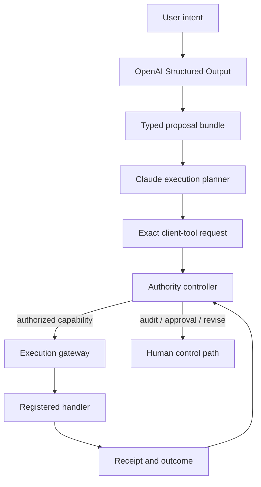

# Cross-Model Execution-Authority Control Loop

[](https://github.com/jasoneplumb/exe-auth-ctrl-loop/actions/workflows/ci.yml)

A prototype that integrates a real OpenAI proposal stage with a real Claude
execution stage while preserving a deterministic, fail-closed authority
boundary.

OpenAI may propose. Claude may request execution. Neither model can grant
authority or directly invoke the registered side-effect handlers. The
host-owned authority controller selects versioned evidence, calculates a
conservative success bound, applies policy, and issues a short-lived,
single-use capability. The execution gateway is the only path to a handler.

> **Status:** private prototype, staged for public release under the
> [Apache-2.0 license](LICENSE). See [SECURITY.md](SECURITY.md) and the
> [production trust boundary](#production-trust-boundary) before reusing any
> of this in a real deployment.

## Architecture



The sequencing is intentional: Claude can reason about the complete bundle, but
every requested operation is evaluated independently immediately before
execution. An earlier plan-level approval is not a bearer credential.

## Implemented model integrations

### OpenAI proposal generation

`OpenAIProposalGenerator` uses `client.responses.parse(...)` with a Pydantic
`ProposalDraftModel`. OpenAI receives a public, read-only tool catalog and
returns one of three states:

- `draft` - incomplete proposal; controller requests revision.
- `needs_clarification` - missing information; controller requests clarification.
- `executable` - every action has exact arguments, effects, preconditions,
  success criteria, assumptions, and unresolved questions.

The host, not OpenAI, resolves tool versions, task categories, risk classes,
and effects from `ToolRegistry`. Model-declared effects must exactly match the
registry. Invalid JSON, unknown tools, invalid parameters, or mismatched
effects fail before authority evaluation.

OpenAI Structured Outputs documentation:
<https://developers.openai.com/api/docs/guides/structured-outputs>

### Claude execution

`ClaudeExecutionAgent` uses Anthropic client tools with `strict: true`. Claude
sees only tools referenced by the proposal bundle. Each call must contain a
`proposal_id`; parallel tool use is disabled so that evidence and authority can
be re-evaluated between effects.

For every Claude tool request, the host verifies:

1. The proposal ID exists in the immutable bundle.
2. The proposal has not already executed.
3. The requested tool exactly matches the proposal.
4. Every argument exactly matches the proposed arguments.
5. Parameters still satisfy the host-owned JSON Schema.
6. Registered effects have not changed.
7. Current evidence and policy authorize this exact operation.
8. The resulting token is current, unrevoked, and unused.

Anthropic client tool documentation:
<https://platform.claude.com/docs/en/agents-and-tools/tool-use/overview>

## Safety invariants

1. **No capability, no execution.** Registered handlers are reachable only through the gateway.
2. **Models do not grant authority.** OpenAI and Claude outputs are untrusted requests.
3. **Exact scope.** A token binds the proposal digest, tool, effects, policy, evidence snapshot, expiry, and one use.
4. **No post-approval mutation.** Changed arguments or tools require a new proposal and decision.
5. **Conservative authority.** Autonomous execution requires the lower bound to clear the applicable risk threshold.
6. **Sparse or stale evidence fails closed.** Missing, immature, invalid, suspended, mismatched, or expired evidence requires approval.
7. **Early proposals cannot execute.** Draft and clarification-needed states never reach Claude.
8. **Severe failures contract immediately.** The exact cross-model partition is suspended before ordinary updating.
9. **Audit selection precedes outcomes.** Audit probability and draw are retained in the decision.
10. **Human-approved outcomes remain distinguishable.** Approval changes the treatment and must not silently inflate autonomous evidence.
11. **Provider diversity is not independence.** End-to-end evidence is collected for the combined pipeline.
12. **Authorization provenance is tamper-evident.** `EventLedger` provides a prototype hash chain.

## Evidence partition

Each exact partition identifies both model roles:

```text
proposal_provider
× proposal_model_version
× proposal_prompt_version
× execution_provider
× execution_model_version
× execution_prompt_version
× tool_version
× policy_version
× environment_version
× task_category
× confidence_bin
× risk_class
```

Changing the OpenAI model or proposal prompt invalidates proposal and
end-to-end evidence. Changing Claude or its execution prompt invalidates
execution and end-to-end evidence. Tool, policy, and environment changes affect
only matching partitions, unless policy explicitly widens invalidation.

Production deployments should maintain related evidence streams for:

- proposal correctness and material human edits;
- execution fidelity to the authorized proposal; and
- acceptable end-to-end outcomes.

The prototype gates on the exact end-to-end partition.

## Conservative bound and policy

The reference estimator is a one-sided Wilson lower bound:

```text
lower_bound = Wilson(successes, successes + failures, z)
```

Autonomous execution requires:

```text
n >= n_min
evidence is current, valid, and unsuspended
lower_bound >= policy.minimum_success_by_risk[risk_class]
```

Policy thresholds must be defined from explicit decision costs. Under the
limited assumptions that autonomous execution costs `(1-s) * C_failure` and
review has fixed cost `C_review`, the break-even condition is:

```text
s >= 1 - C_review / C_failure
```

Real policies may impose a higher safety floor or model more decision
alternatives and outcome-dependent costs.

## Repository layout

| Path | Purpose |
| --- | --- |
| `src/exe_auth_ctrl_loop/authority.py` | Domain records, evidence store, Wilson bound, policy evaluation, capability issuance, gateway |
| `src/exe_auth_ctrl_loop/tools.py` | Host-owned tool registry, JSON Schema validation, Anthropic tool definitions |
| `src/exe_auth_ctrl_loop/providers.py` | OpenAI Structured Output models and proposal generator |
| `src/exe_auth_ctrl_loop/executor.py` | Claude client-tool loop with per-operation authorization |
| `src/exe_auth_ctrl_loop/pipeline.py` | OpenAI-to-Claude orchestration with event recording |
| `src/exe_auth_ctrl_loop/ledger.py` | In-memory tamper-evident event hash chain |
| `examples/example.py` | Offline deterministic example |
| `examples/live_example.py` | Live OpenAI and Anthropic API example using a harmless mock handler |
| `tests/` | Authority, provider, execution, mutation, approval, and ledger acceptance tests |

## Getting started

Requires Python 3.10+.

```bash
python -m venv .venv
. .venv/bin/activate
pip install -e ".[dev]"
```

### Run offline tests and example

The tests use fake provider clients and never call an external API:

```bash
pytest
python examples/example.py
```

### Lint and type-check

```bash
ruff check .
mypy src
```

### Run the live cross-model example

Set credentials and explicit model identifiers:

```bash
export OPENAI_API_KEY="..."
export ANTHROPIC_API_KEY="..."
export OPENAI_MODEL="your-pinned-openai-model"
export ANTHROPIC_MODEL="your-pinned-claude-model"
python examples/live_example.py
```

The live example gives both models real API roles but exposes only
`record_refund_request`, a local mock handler that does not move money. Its
seeded evidence is explicitly illustrative and must not be treated as
production evidence.

## Human approval

When a decision routes to `human_approval` or `audit`,
`ClaudeExecutionAgent.run()` returns without invoking the handler. A reviewed
caller can restart with the exact proposal ID in `approved_proposal_ids`.
Denials, draft states, and clarification requests cannot be overridden by that
mechanism; they require a corrected proposal or policy change.

## Production trust boundary

This remains an in-process prototype. A production deployment should:

- place the gateway and credentials in a separate service identity and process;
- prevent both model runtimes from accessing handlers or credentials directly;
- sign capabilities or store opaque capability references server-side;
- consume capabilities transactionally before performing side effects;
- use durable append-only storage and cryptographic tool receipts;
- authenticate human approvals with role and scope checks;
- enforce idempotency and replay protection at each external service;
- isolate Claude code or shell execution in an OS sandbox;
- independently verify outcomes through readback, tests, or service receipts;
- pin dependency and model versions used for every evidence partition; and
- red-team prompt injection, confused-deputy, data poisoning, and
  credential-exfiltration paths.

The core boundary remains unchanged: OpenAI proposes, Claude requests,
deterministic policy authorizes, and the gateway executes.

## License

Licensed under the [Apache License, Version 2.0](LICENSE). See
[NOTICE](NOTICE) for attribution.
