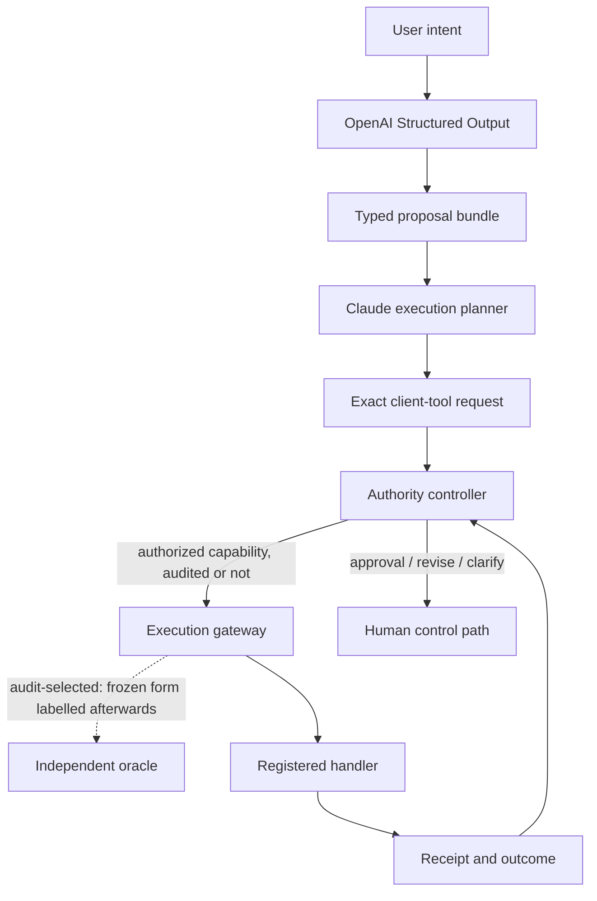

# Cross-Model Execution-Authority Control Loop

[](https://github.com/jasoneplumb/exe-auth-ctrl-loop/actions/workflows/ci.yml)
[](https://doi.org/10.5281/zenodo.21983061)
[](https://doi.org/10.5281/zenodo.21894658)
[](LICENSE)
[](pyproject.toml)
[](https://github.com/jasoneplumb/exe-auth-ctrl-loop/releases)

A prototype that integrates a real OpenAI proposal stage with a real Claude
execution stage while preserving a deterministic, fail-closed authority
boundary.

OpenAI may propose. Claude may request execution. Neither model can grant
authority or directly invoke the registered side-effect handlers. The
host-owned authority controller selects versioned evidence, calculates a
conservative success bound, applies policy, and issues a short-lived,
single-use capability. The execution gateway is the only path to a handler.

> **Status:** research prototype, released under the
> [Apache-2.0 license](LICENSE). See [SECURITY.md](SECURITY.md) and the
> [production trust boundary](#production-trust-boundary) before reusing any
> of this in a real deployment.

The design is published as a timestamped defensive disclosure:
*Evidence-Partitioned Autonomy Authorization for LLM Agents: Single-Use
Capability Tokens, a Selection-Bias Firewall, and Pre-Outcome Committed Audit
Selection in a Cross-Model Execution-Authority Control Loop*
([Technical Disclosure Commons](https://www.tdcommons.org/dpubs_series/11356/) ·
[DOI 10.5281/zenodo.21894658](https://doi.org/10.5281/zenodo.21894658)).
See [CITATION.cff](CITATION.cff) for citation metadata.

## In one minute

**The problem.** When an LLM agent can call a tool that moves money, deletes a
record, or sends a message, the decision to allow that call usually lives in the
same conversation that requested it. A plan approved once becomes a bearer
credential: arguments drift, a second call reuses the first call's blessing, and
the model that asked is also, effectively, the model that answered.

**What this does.** Authority is moved out of the models entirely. A host-owned
controller evaluates each operation immediately before it runs, against
versioned evidence for that exact model/tool/policy partition, and mints a
capability bound to one proposal digest, one tool, one effect set, one short
expiry, one use. The gateway holding that capability is the only path to a
registered handler. Every check is additive and failure-closed: one unmet
condition withholds autonomy, and no weighing overrides it.

**Contribution.** Design, implementation, tests, and disclosure are mine, with
AI-assisted implementation under human review (see
[CONTRIBUTING.md](CONTRIBUTING.md)). The proposal and execution stages call the
OpenAI and Anthropic APIs; the authority controller, evidence partitioning,
capability gateway, ledger, and MCP binding are this repository's own code.

**See it refuse.** No API keys, no network:

```bash
python examples/denials.py
```

```text
sparse evidence              route=human_approval reasons=('EVIDENCE_IMMATURE', 'BOUND_BELOW_POLICY')
stale evidence               route=human_approval reasons=('EVIDENCE_STALE',)
no exact evidence            route=human_approval reasons=('NO_EXACT_EVIDENCE',)
unresolved question          route=clarification  reasons=('UNRESOLVED_QUESTIONS',)
authorized (before edit)     route=autonomous     reasons=('AUTHORITY_SUFFICIENT',)
arguments edited             gateway denied: proposal changed after authorization
first use                    handler ran: ['op-mutated']
replayed capability          gateway denied: missing, consumed, or revoked token
```

Six requests, one effect: the single request that was authorized and reached
the gateway unmodified. `python examples/example.py` shows the authorized path
on its own; `python examples/mcp_demo.py` shows the same authorization carried
across an MCP `tools/call`.

### Results

| | |
| --- | --- |
| **Contribution** | Sole author of the controller, gateway, evidence partition, ledger, and MCP binding; AI-assisted implementation with human review. Model providers supply the proposal and execution stages only. |
| **Status** | Research prototype. Not deployed, not hardened, no production users. |
| **Evidence** | Output above, reproduced from `examples/denials.py` on Python 3.14 (macOS). 201 tests pass offline against fake provider clients. Fifteen seeded simulation scenarios reproduce bit-for-bit (`results/manifest.json`). Design disclosed at [Technical Disclosure Commons](https://www.tdcommons.org/dpubs_series/11356/) and [Zenodo](https://doi.org/10.5281/zenodo.21894658). |
| **Reproduction** | `pip install -e ".[dev]"` then `pytest && python examples/denials.py`; `python -m experiments.run --all --output results` for the simulation. Offline; the live cross-model path needs API keys and is separate. See [docs/paper-v2/reproducibility.md](docs/paper-v2/reproducibility.md). |
| **Limitations** | In-process only: the gateway shares an address space with its caller, token consumption is serialized by an in-process lock rather than a transactional store, the ledger is an in-memory hash chain, and evidence is not persisted. When the gateway is given the live evidence store, policy, and lifecycle, a token issued before a suspension, policy change, evidence invalidation, or loss of autonomy is refused at redemption; see [docs/v2/gateway-redemption.md](docs/v2/gateway-redemption.md) and the [production trust boundary](#production-trust-boundary). |

## Architecture


```mermaid
flowchart TD
    A["User intent"] --> B["OpenAI Structured Output"]
    B --> C["Typed proposal bundle"]
    C --> D["Claude execution planner"]
    D --> E["Exact client-tool request"]
    E --> F["Authority controller"]
    F -->|authorized capability, audited or not| G["Execution gateway"]
    F -->|approval / revise / clarify| H["Human control path"]
    G -.->|audit-selected: frozen form labelled afterwards| K["Independent oracle"]
    G --> I["Registered handler"]
    I --> J["Receipt and outcome"]
    J --> F
```

The sequencing is intentional: Claude can reason about the complete bundle, but
every requested operation is evaluated independently immediately before
execution. An earlier plan-level approval is not a bearer credential.

## Implemented model integrations

### OpenAI proposal generation

`OpenAIProposalGenerator` uses `client.responses.parse(...)` with a Pydantic
`ProposalDraftModel`. OpenAI receives a public, read-only tool catalog and
returns one of three states:

- `draft` - incomplete proposal; controller requests revision.
- `needs_clarification` - missing information; controller requests clarification.
- `executable` - every action has exact arguments, effects, preconditions,
  success criteria, assumptions, and unresolved questions.

The host, not OpenAI, resolves tool versions, task categories, risk classes,
and effects from `ToolRegistry`. Model-declared effects must exactly match the
registry. Invalid JSON, unknown tools, invalid parameters, or mismatched
effects fail before authority evaluation.

OpenAI Structured Outputs documentation:
<https://developers.openai.com/api/docs/guides/structured-outputs>

### Claude execution

`ClaudeExecutionAgent` uses Anthropic client tools with `strict: true`. Claude
sees only tools referenced by the proposal bundle. Each call must contain a
`proposal_id`; parallel tool use is disabled so that evidence and authority can
be re-evaluated between effects.

For every Claude tool request, the host verifies:

1. The proposal ID exists in the immutable bundle.
2. The proposal has not already executed.
3. The requested tool exactly matches the proposal.
4. Every argument exactly matches the proposed arguments.
5. Parameters still satisfy the host-owned JSON Schema.
6. Registered effects have not changed.
7. Current evidence and policy authorize this exact operation.
8. The resulting token is current, unrevoked, and unused.

Anthropic client tool documentation:
<https://platform.claude.com/docs/en/agents-and-tools/tool-use/overview>

### MCP protocol binding

`exe_auth_ctrl_loop.mcp` carries an authorization with the tool call it authorizes, as
vendor-namespaced metadata under `com.jasoneplumb.exe-auth/` on `tools/call` requests. The
block carries the proposal digest, the evidence-snapshot hash, and the committed audit flag,
and it is signed: `_meta` rides on a request a model asked for, so an unsigned block would be
a claim a server cannot check.

A receiving server recomputes the call digest from the tool name and arguments it actually
received. Edited arguments, a substituted tool, a forged or stripped signature, and an
expired authorization each deny.

See [docs/mcp-extension.md](docs/mcp-extension.md) for the key specification and the
verification order, and `python examples/mcp_demo.py` for a runnable round trip.

## Safety invariants

1. **No capability, no execution.** Registered handlers are reachable only through the gateway.
2. **Models do not grant authority.** OpenAI and Claude outputs are untrusted requests.
3. **Exact scope.** A token binds the proposal digest, tool, effects, policy, partition, evidence snapshot, expiry, and one use. One stated exception: a human-approved token binds the evidence snapshot it was approved against only for degradation (suspension, invalidation), not for replacement by a healthy successor record, because a human approval is consent to one operation rather than reliance on a track record (see [docs/v2/gateway-redemption.md](docs/v2/gateway-redemption.md)).
4. **No post-approval mutation.** Changed arguments or tools require a new proposal and decision.
5. **Conservative authority.** Autonomous execution requires the lower bound to clear the applicable risk threshold.
6. **Sparse or stale evidence fails closed.** Missing, immature, invalid, suspended, mismatched, or expired evidence requires approval.
7. **Early proposals cannot execute.** Draft and clarification-needed states never reach Claude.
8. **Severe failures contract immediately.** The exact cross-model partition is suspended before ordinary updating.
9. **Audit selection precedes outcomes.** The audit draw is realized in the decision and committed to the ledger before a token is issued; if the commit fails, the step is refused. Independence from results holds given a trusted RNG and controller; it is an ordering guarantee, not a proof against a malicious host (see [docs/v2/audit-commitment.md](docs/v2/audit-commitment.md)).
10. **Human-approved outcomes remain distinguishable.** Approval changes the treatment and must not silently inflate autonomous evidence.
11. **Provider diversity is not independence.** End-to-end evidence is collected for the combined pipeline.
12. **Authorization provenance is tamper-evident within the chain.** `EventLedger` is an in-memory hash chain: `verify()` detects edits to retained events, and does not detect truncation of the tail or wholesale replacement by whoever holds the chain. External anchoring would close that gap and is demonstrated, not provided.

## Evidence partition

Each exact partition identifies both model roles:

```text
proposal_provider
× proposal_model_version
× proposal_prompt_version
× execution_provider
× execution_model_version
× execution_prompt_version
× tool_version
× policy_version
× environment_version
× task_category
× confidence_bin
× risk_class
```

Changing the OpenAI model or proposal prompt invalidates proposal and
end-to-end evidence. Changing Claude or its execution prompt invalidates
execution and end-to-end evidence. Tool, policy, and environment changes affect
only matching partitions, unless policy explicitly widens invalidation.

Production deployments should maintain related evidence streams for:

- proposal correctness and material human edits;
- execution fidelity to the authorized proposal; and
- acceptable end-to-end outcomes.

The prototype gates on the exact end-to-end partition.

## Conservative bound and policy

The reference estimator is the lower endpoint of a Beta-mixture confidence
sequence (`Policy.estimator = "beta_mixture"`, `Policy.alpha`), which remains
valid when the evidence is re-read before every operation:

```text
lower_bound = BetaMixtureCS(successes, failures, alpha)
```

See [docs/v2/statistical-method.md](docs/v2/statistical-method.md) for the
proposition, its assumptions (i.i.d. labels within an epoch, no selection of
trials, conservative censoring, oracle validity), and reference vectors. The
v0.2.0 one-sided Wilson bound is retained as `estimator = "wilson_legacy"` for
comparison only; it is a fixed-sample interval and exceeds its nominal error
rate when read repeatedly. Neither bound protects against an agent that behaves
until it qualifies and then defects; that is the job of the deterministic
controls (per-operation checks, single-use tokens, suspension), not the
statistics.

Autonomous execution requires:

```text
n >= n_min
evidence is current, valid, and unsuspended
lower_bound >= policy.minimum_success_by_risk[risk_class]
```

Policy thresholds must be defined from explicit decision costs. Under the
limited assumptions that autonomous execution costs `(1-s) * C_failure` and
review has fixed cost `C_review`, the break-even condition is:

```text
s >= 1 - C_review / C_failure
```

Real policies may impose a higher safety floor or model more decision
alternatives and outcome-dependent costs.

## Repository layout

| Path | Purpose |
| --- | --- |
| `src/exe_auth_ctrl_loop/authority.py` | Domain records, evidence store, policy evaluation with the sequential bound, capability issuance, gateway with redemption-time checks |
| `src/exe_auth_ctrl_loop/shadow.py` | Frozen shadow trials, oracle labels, provenance-separated counts, epochs |
| `src/exe_auth_ctrl_loop/lifecycle.py` | `UNESTABLISHED / QUALIFYING / AUTONOMOUS / SUSPENDED` state machine over shadow evidence |
| `src/exe_auth_ctrl_loop/sequential.py` | Beta-mixture confidence sequence (anytime-valid lower bound); Wilson kept as legacy |
| `src/exe_auth_ctrl_loop/risk.py` | Host-owned risk envelopes, sequence budgets, decision- and redemption-time guards |
| `src/exe_auth_ctrl_loop/tools.py` | Host-owned tool registry, JSON Schema validation, risk classification, Anthropic tool definitions |
| `src/exe_auth_ctrl_loop/providers.py` | OpenAI Structured Output models and proposal generator |
| `src/exe_auth_ctrl_loop/executor.py` | Claude client-tool loop with per-operation authorization and commit-before-act |
| `src/exe_auth_ctrl_loop/pipeline.py` | OpenAI-to-Claude orchestration, ledger commit, audit freezing |
| `src/exe_auth_ctrl_loop/ledger.py` | In-memory hash chain with decision commit and an anchoring demonstration |
| `src/exe_auth_ctrl_loop/mcp.py` | MCP binding: signed authority metadata on `tools/call` |
| `docs/v2/` | v2 specification, threat model, method note, per-mechanism contracts, gate reports |
| `docs/paper-v2/` | Claims matrix, worked example from `n=0`, manuscript plan, reproducibility, release plan |
| `docs/mcp-extension.md` | Key specification for the MCP extension |
| `experiments/`, `results/` | Simulated evaluation harness, configs, and hash-manifested outputs |
| `examples/example.py` | Offline deterministic example |
| `examples/mcp_demo.py` | Offline MCP round trip, including the denial paths |
| `examples/live_example.py` | Live OpenAI and Anthropic API example using a harmless mock handler |
| `tests/` | Offline acceptance tests for every mechanism above, including adversarial and concurrency cases |

## Getting started

Requires Python 3.10+.

```bash
python -m venv .venv
. .venv/bin/activate
pip install -e ".[dev]"
```

### Run offline tests and example

The tests use fake provider clients and never call an external API:

```bash
pytest
python examples/example.py
python examples/denials.py
python examples/mcp_demo.py
```

### Lint and type-check

```bash
ruff check .
mypy src
```

### Run the live cross-model example

Set credentials and explicit model identifiers:

```bash
export OPENAI_API_KEY="..."
export ANTHROPIC_API_KEY="..."
export OPENAI_MODEL="your-pinned-openai-model"
export ANTHROPIC_MODEL="your-pinned-claude-model"
python examples/live_example.py
```

The live example gives both models real API roles but exposes only
`record_refund_request`, a local mock handler that does not move money. Its
seeded evidence is explicitly illustrative and must not be treated as
production evidence.

## Simulated evaluation

`experiments/` drives the real controller, lifecycle, shadow log, risk policy,
and gateway with a synthetic proposal stream from an empty evidence store, and
`results/` holds the seeded, hash-manifested outputs of fifteen scenarios
(stable, never-qualifies, correlated failures, distribution shift, delayed
defection, turnover, audit rates, risk envelopes, censoring, oracle noise, a
suspension/release cycle, and two comparators). It is a simulation: read
[experiments/README.md](experiments/README.md) for what is modelled, where the
adjudication is unrealistically strong, and what the numbers do not show.

```sh
python -m experiments.run --all --output results
```

## Human approval

When a decision routes to `human_approval`, `ClaudeExecutionAgent.run()`
returns without invoking the handler. A reviewed caller can restart with the
exact proposal ID in `approved_proposal_ids`. Denials, draft states, and
clarification requests cannot be overridden by that mechanism; they require a
corrected proposal or policy change.

An `audit` route is not a human gate. It executes unattended like
`autonomous`; what the pre-outcome draw selects is which executions get an
independent label afterwards. With a shadow log attached to the loop, the
proposal is frozen before the token is issued and the label is bound to that
frozen form (see [docs/v2/audit-commitment.md](docs/v2/audit-commitment.md)).

## Versions and lineage

| Artifact | Identifier | Status |
|---|---|---|
| Software v0.1.0 | commit `f070e01`, DOI 10.5281/zenodo.21983062 | released 2026-08-17 |
| Software v0.2.0 | commit `b266eb7`, DOI 10.5281/zenodo.22730700 | released 2026-09-12 |
| Concept DOI (all versions) | 10.5281/zenodo.21983061 | resolves to the latest release |
| Design disclosure | DOI 10.5281/zenodo.21894658; TDCommons dpubs 11356 | published 2026-08 |
| Paper v1 | manuscript on the v0.2.0 design, August 2026 | not published; retained as written |
| Software v2 (`research/v2`) | proposed 0.3.0; see [docs/paper-v2/release-plan.md](docs/paper-v2/release-plan.md) | not released, not tagged, no DOI |
| Paper v2 | plan in [docs/paper-v2/manuscript-plan.md](docs/paper-v2/manuscript-plan.md) | not written as prose, not submitted |

What v2 changes relative to the v1 design and paper, in one paragraph: a
partition can now earn autonomy from an empty evidence store, through shadow
trials frozen before human review and labelled by an independent oracle; the
evidence gate is an anytime-valid confidence sequence instead of a fixed-sample
bound read at every decision; an issued token is refused at redemption once
its justification is withdrawn; risk class is derived by the host from the
arguments; decisions are committed to the ledger before any token exists;
audited operations execute unattended and are labelled afterwards; and the
design is evaluated in a seeded simulation that reports where it fails. The
claims-to-evidence map is
[docs/paper-v2/claims-matrix.md](docs/paper-v2/claims-matrix.md).

## Production trust boundary

This remains an in-process prototype. A production deployment should:

- place the gateway and credentials in a separate service identity and process;
- prevent both model runtimes from accessing handlers or credentials directly;
- sign capabilities or store opaque capability references server-side;
- consume capabilities transactionally before performing side effects;
- use durable append-only storage and cryptographic tool receipts, and anchor
  the ledger head somewhere the controller cannot write;
- authenticate human approvals with role and scope checks;
- enforce idempotency and replay protection at each external service;
- isolate Claude code or shell execution in an OS sandbox;
- independently verify outcomes through readback, tests, or service receipts;
- pin dependency and model versions used for every evidence partition; and
- red-team prompt injection, confused-deputy, data poisoning, and
  credential-exfiltration paths.

The core boundary remains unchanged: OpenAI proposes, Claude requests,
deterministic policy authorizes, and the gateway executes.

## License

Licensed under the [Apache License, Version 2.0](LICENSE). See
[NOTICE](NOTICE) for attribution.
